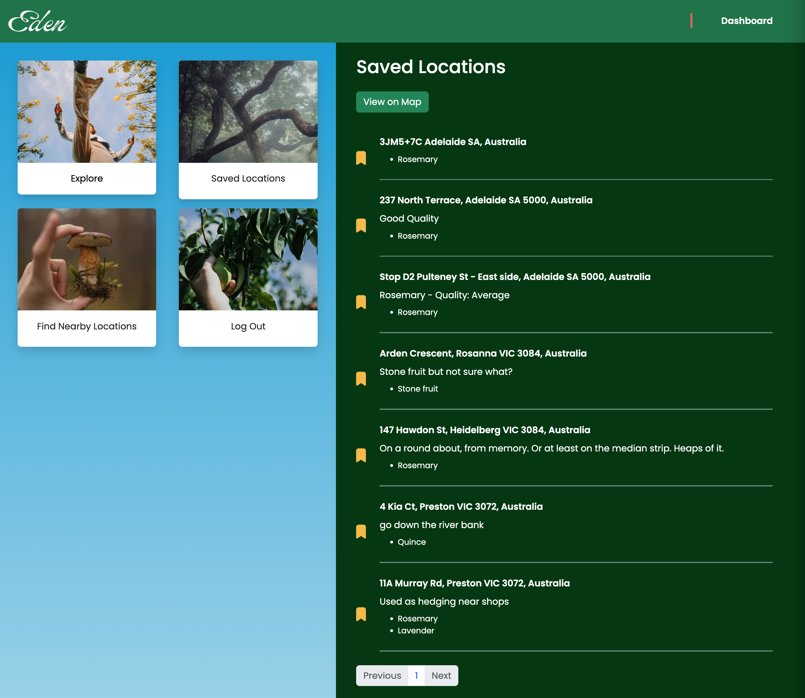
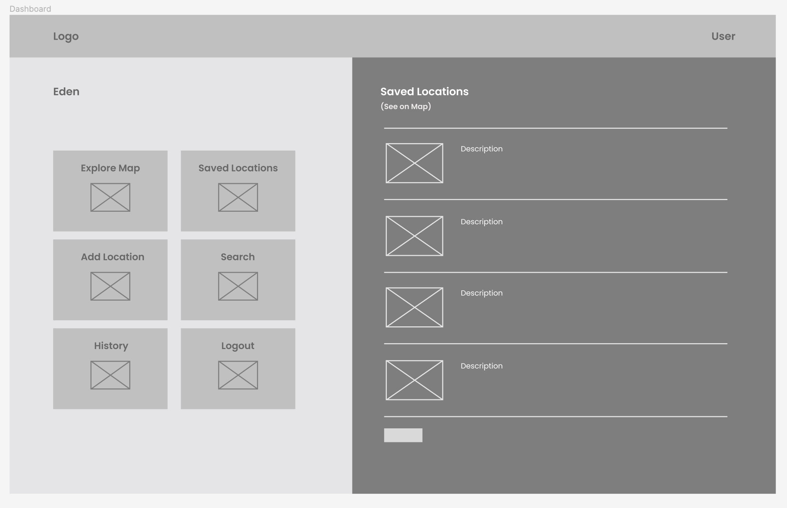
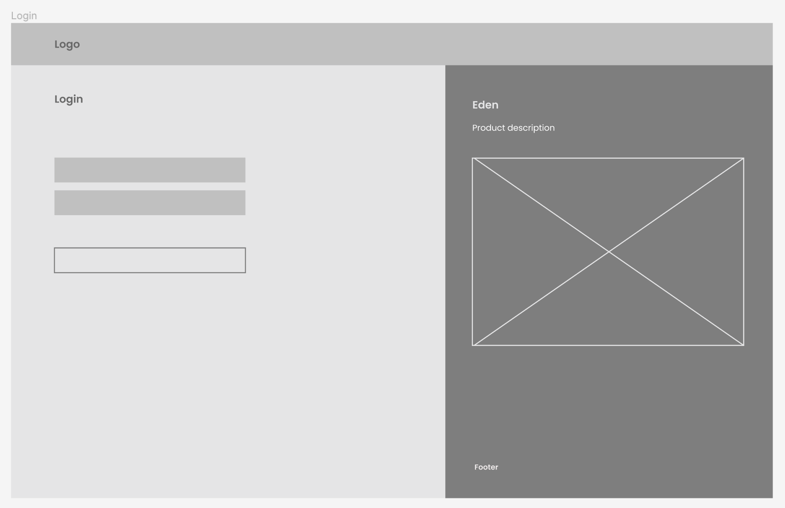

# 🌾 Eden

Eden is an application designed to help users discover local edible foraging spots in their area. By using the client's location, the app fetches data about nearby foraging locations and displays them on an interactive map. Users can explore these locations, view details about each spot, including the plants available, and mark their favorites for future reference.

## 👋 User Stories

Eden is suitable for all individuals interested in foraging for edible plants.

-   <b>New Foragers:</b> Those who are new to foraging and want to learn about edible plants in their area, with confirm using other user's locations.

-   <b>Casual Foragers:</b> Foragers who enjoy foraging spots and want to diversify their experiences. They are interested in discovering new locations and learning more about local flora.

-   <b>Experienced Foragers:</b> Individuals with extensive foraging experience who seek detailed information about foraging locations, plant species, and regulations. They may also be interested in sharing their knowledge and connecting with other foragers.

### [Link to User Stories](https://trello.com/b/ukFy1e1D/project-4-eden)

## Screenshots

**Dashboard:**

**Landing Page:**

## Wireframes

**Dashboard:**

**Landing Page:**

## Technologies Used

-   React
-   JavaScript
-   Bootstrap
-   Google Maps API
-   Falling Fruit API
-   Supabase with PostgreSQL backend

## Approach

In developing the Eden app, I began by conducting research to explore different ideas for the application's concept. I had a rough idea of what I wanted to build, and found an API that could provide the necessary data. The API (Falling Fruit) provides information about local edible foraging spots worldwide, but the UX/UI is unmaintained and outdated. My goal was to build something similar, but more user friendly and interactive.

Once the research was complete, I moved on to brainstorming user stories to define the target audience and their needs. Understanding the users' motivations and goals helped shape the direction of the app and prioritise features that would provide the most value.

With user stories in mind, I created some simple wireframes to visualise the major views and interfaces within the application. These wireframes served as a blueprint for the app's layout.

Next, I planned and created schemas using Supabase as the backend solution, using PostgreSQL as a database. This involved defining the structure of the data to be stored and establishing relationships between different entities to ensure efficient data management.

After setting up Supabase, I outlined the various pages and components needed to bring the app to life using React. This step involved breaking down the user interface into smaller components and implementing them according to the wireframes and user stories.

Throughout the development process, I encountered several challenges and obstacles. However, through perseverance and problem-solving (and let's be honest, my stubbornness and refusal to take 'no' for an answer), I was able to overcome most of these hurdles to bring the project together.

While my MVP user stories have been completed, I consider Eden a work in progress. I am happy with the look and feel of the website, but will be adding other features to make the website more interactive.

## Installation and Setup

1. Clone the repository: `git clone https://github.com/sierrabardot/eden.git`
2. Navigate to the project directory: `cd eden`
3. Install dependencies: `npm install`
4. Create your .env and add the required info: `touch .env`
5. Start the development server: `npm run dev`
6. Open your browser and navigate to `http://localhost:5173` to view the app.

## 🪲 Unsolved Problems/Major Hurdles

-   I initially tried to learn TypeScript and MobX state management library, however I realised that mastering TypeScript would require more time than initially anticipated, and the complexity of state management was unnecessary for a small scale app. (rookie mistake 😅)

-   Due to time constraints, certain planned features could not be implemented. One feature that was reluctantly cut was a form for users to leave reviews about foraging spots. Time limitations also prevented the implementation of an unfavorite functionality, allowing users to remove locations from their favorites list

-   I had issues implementing reverse geolocation with large sets of data. This may have been due to innefficiency in the implementation of reverse geolocation functionality.

-   That there was a lack of understanding regarding how context providers could affect the behavior of React Router, which led to unexpected behaviour and issues with routing functionality.
